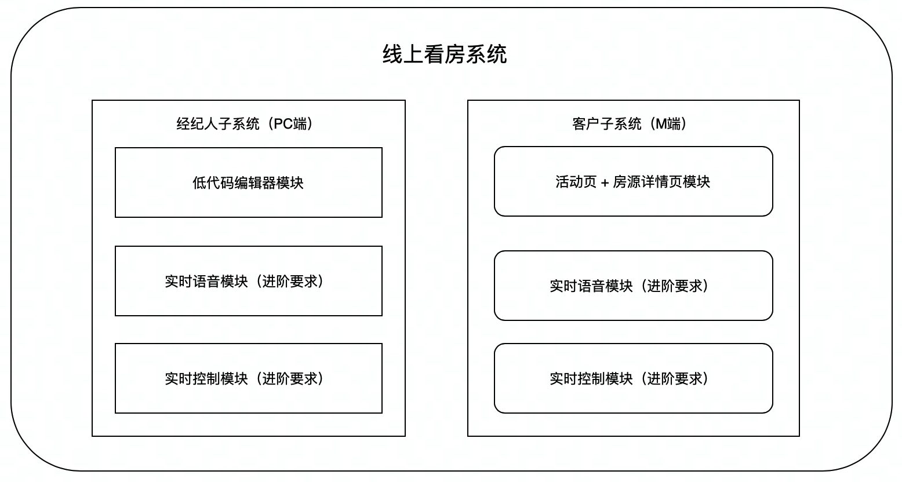

# 麦荣MyRoom 镜像计划第六小组开发指南

欢迎字节跳动镜像计划`Team6`同学加入麦荣Web开发项目。这里有项目的开发计划、工作安排和一些实用资料。我们希望大家与其他营员小伙伴充分交流，与技术导师积极沟通，最终共同完成一个让人赞叹的项目，在一个月的时间内收获属于自己的进步！

## ⏰ 重要时间节点 Time Table
 
 **距离项目提交截止日期：** 10 天
 **距离下一次线上课堂：** 0 天
 
 ## 🪟 日程安排

| 日期| 时间 | 安排 | 备注 |
|---|:--|---|---|
| 5月6日 | 19:00 | 开营班会，第一次课 | 已结束 |
| 5月13日 | 20:00 | 线上课堂1 | 已结束 |
| 5月20日 | 20:00 | 线上课堂2 | 已结束,讲解了低代码编辑器的基本实现 |
| 5月27日 | 20:00 | 线上课堂3 | 签到截止5月21日23:59 |
| 5月27日 | 20:00 | 线上课堂4 | 签到截止5月28日23:59 |
| 5月30日 | 20:00 | 空中答疑课+直播分享课 | 星期一，无签到，字节工程师及HR参与 |
| **6月5日** | 23:59 | 项目成果提交 | 提交作品Deadline |
| 6月10日 | 20:00 | 项目评分结果 | 结束 |

## 💾  开发文档快速访问通道

1. [MyRoom系统开发需求文档 >>> ](https://bytedance.feishu.cn/docx/doxcnT9YVJUcVQYY2dyGAmn97cZ)
2. [MyRoom项目原型设计 >>>](https://bytedance.feishu.cn/docx/doxcnT9YVJUcVQYY2dyGAmn97cZ) 
3. [前端快速入门手册 >>> ](https://bytedance.feishu.cn/docx/doxcn9MPyw9sfmfEVO2Ki9exRPt)

## 💻 Team6 开发团队

| Name | 技术栈 |
|:-:|:--|
| 王绪东 | 微信小程序+HarmonyOS 后端 express,mysql,spring会一点 |
| 蒋希来 | Android移动端（java+kotlin）+微信小程序(wxml+wxss+js) 后端会一点django和mysql |
| 魏榕 | react+typescript+redux+antd 后端用过express+mongodb |
| 金聿成 | bootstrap+javascript+nodejs+springboot |
| 郑成辰 | vue ts |
| 黄辉煌 | 待补充 |
| 刘洋 | vue2/3+ts+ vuex，微信小程序，后端懂点express+mongodb |
| 苏宇 | react+javascript+redux+antd 后端用过egg.js+mysql |
| 申帆 | vue2/3+ vuex，后端懂点node/express |

## 🚩 分队情况

 **A小队** `开发经纪人子系统(PC端)` 
> 魏榕、金聿成、苏宇、⻩辉煌、申帆

 **B小队** `开发客户子系统(M端)`
> 蒋希来、郑成辰

 **C小队** `开发后端`
> 王绪东、刘洋

## 🌆 项目版本信息

`pre-alpha 0.0.1`
- [x] Git仓库构建，React项目base构建 *May, 8, 2022*
- [x] 组长选举，小队分配
- [x] MyRoom项目架构设计

## 📖 项目说明

在房产行业中，经纪人带客户看房是每天的必备工作。但现在由于疫情的原因，很多城市无法实现经纪人带看，对线下房产行业影响巨大。为了帮助经纪人解决这一难题，实现经纪人和客户线上互动，线上介绍房源，了解对比房源，我们本次设计线上看房系统`MyRoom麦荣`，解决经纪人这一难题。

### 项目初级目标
**经纪人子系统**
- 开发一个低代码编辑器，可以通过拖拽的方式合成一个宣传活动页，并支持预览的功能。低码编辑器中的可编辑模块包括：文字、图片、视频、语音、房源卡片（点击可跳转到展示子系统展示页面）
- 开发历史活动页编辑及查阅的功能

**展示子系统**
- 开发低码编辑器的解析引擎，通过解析低码编辑器产出的数据，生成一个移动端页面
- 开发房源详情页

### 项目开发记录

To be filled...

### 运行项目
1. 确保您安装了`node.js v16.15.0`或更新版本；
2. 进入项目目录后，执行`npm start`即可使用。

